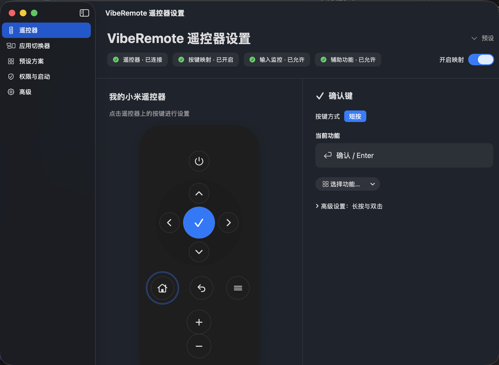

# VibeRemote

VibeRemote 把小米语音遥控器变成 macOS AI Coding 遥控器。程序驻留在菜单栏，普通设置使用中文界面，原始 HID 数据保留在“高级 → HID 调试器”。

目前支持的小米语音遥控器：Vendor ID `0x2717`、Product ID `0x32B0`。所有 HID 数据、按键映射和快捷键发送都在本机完成。



## 从源码构建

要求：macOS 13 或更高版本，以及包含 macOS 13 SDK 或更高版本的 Xcode。

1. 克隆仓库并打开 `VibeRemote.xcodeproj`。
2. Target 选择 `VibeRemote`，运行目标选择 `My Mac`。
3. 如 Xcode 要求签名，在 Signing & Capabilities 中选择你自己的 Team，或使用本地运行签名。
4. 点击 Run。正式使用时请将构建出的 App 固定放在 `/Applications/VibeRemote.app`，避免权限绑定到临时构建副本。

命令行只验证编译：

```sh
xcodebuild -project VibeRemote.xcodeproj \
  -scheme VibeRemote \
  -configuration Release \
  CODE_SIGNING_ALLOWED=NO build
```

## 首次运行

1. 将 `VibeRemote.app` 放入 `/Applications`。
2. 在“系统设置 → 隐私与安全性 → 输入监控”允许 VibeRemote 读取遥控器。
3. 在“系统设置 → 隐私与安全性 → 辅助功能”允许 VibeRemote 发送快捷键。
4. 修改权限后退出并重新打开 VibeRemote。

VibeRemote 是菜单栏 App，正常启动后不会显示 Dock 图标；请点击菜单栏中的 `R` 图标打开设置。

## 使用方法

1. 先在 macOS 蓝牙设置中连接“小米语音遥控器”。
2. 启动 VibeRemote，在顶部确认“遥控器 · 已连接”“输入监控 · 已允许”“辅助功能 · 已允许”。
3. 打开“开启映射”。此后实体遥控器按键会执行下方默认功能。
4. 点击界面遥控器上的按键，可修改短按功能；长按和双击位于该按键的“高级设置”。
5. 在“应用切换器”中添加 2～5 个常用 App。短按 HOME 打开浮层，方向键选择，确认或 HOME 切换，返回取消。
6. 使用听写前，先在“系统设置 → 键盘 → 听写”开启系统听写。长按 HOME，或按菜单键，开始/停止听写。

排查原始输入时，打开“高级 → HID 调试器”；关闭“开启映射”后，只记录 HID 数据，不会发送快捷键。

## 默认按键

| 遥控器按键 | 默认功能 |
|---|---|
| 上 / 下 | 上移 / 下移 |
| 左 | Esc |
| 右 | Tab |
| 确认 | Enter |
| 返回 | Shift + Tab |
| HOME 短按 | 打开应用切换器 |
| HOME 长按 | macOS 系统听写 |
| 音量 + / − | Command + ] / Command + [ |
| 菜单（三条杠） | Fn：开始 / 停止系统听写 |
| 电源 | 不额外执行操作 |

应用切换器保存 2～5 个常用 App。方向键选择，确认或 HOME 切换，返回取消；未运行的 App 会自动启动。

## 配置

按键映射仍保存在：

```text
~/Library/Application Support/VibeRemote/mapping.json
```

旧版 `mapping.json` 会自动读取；仍使用默认 `Command + Tab` 的 HOME 短按会自动迁移为应用切换器。应用切换器列表按 Bundle Identifier 保存在系统偏好中，不改变旧 JSON 格式。

在“预设方案”或“高级 → 恢复默认按键映射”可以恢复默认设置。

## Agent 执行单

[从零执行单](./从零执行单.md) 记录了项目踩坑、修复顺序、验收标准和后续多设备扩展方案。该文档是 Agent 执行计划，其中的 PS4、PS5、PS3 支持属于后续规划，不代表当前版本已经实现。

## 开源许可

本项目采用 [MIT License](./LICENSE)。
